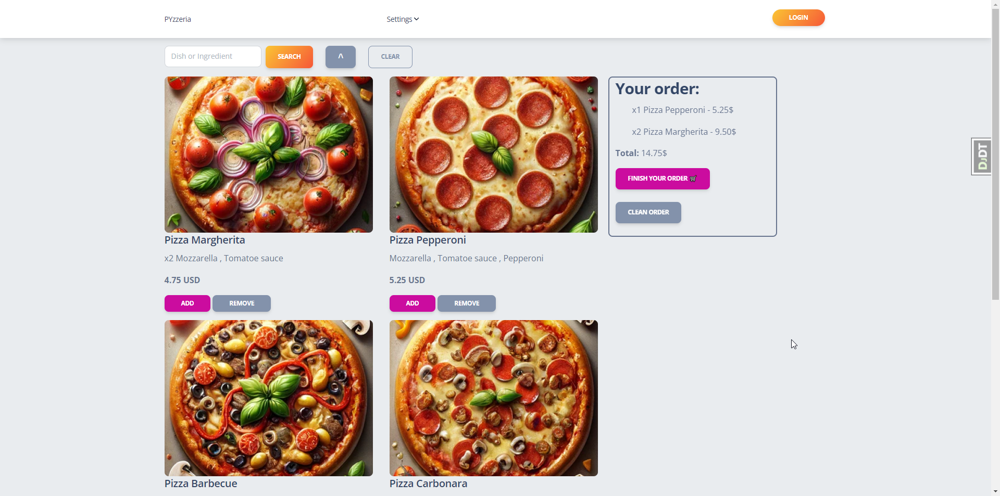

# pyzzeria
Welcome to the PYzzeria web application! This application allows customers to browse, order, and manage pizza orders. It also includes an admin interface for managing pizzas, ingredients, and orders.

## Features
- Browse available pizzas and ingredients.
- Place orders for pizzas.
- User authentication and profile management.
- Admin interface for managing pizzas, ingredients, and orders.
- Search functionality for pizzas and ingredients.
- And many more.

## Installation

1. **Clone the repository:**

   ```sh
   git clone https://github.com/panicua/pyzzeria.git
   cd pyzzeria
   ```
   
2. Create and activate **venv** (bash):
   ```sh
   python -m venv venv
   source venv/Scripts/activate
   ```
   Windows (Command Prompt)
   ```sh
   python -m venv venv
   venv\Scripts\activate
   ```
   Mac / Linux (Unix like systems)
   ```sh
   python3 -m venv venv
   source venv/bin/activate
   ```
   
3. Install **requirements.txt** to your **venv**:
   ```sh
   pip install -r requirements.txt
   ```
4. Create a `.env` file in the root of the project directory. You can use the `.env.example` file as a template:
    ```sh
    cp .env.example .env
    ```
5. Create apply migrations:
   ```sh
   python manage.py migrate
   ```
6. (Optional) Create a superuser to get access to admin panel:
   ```sh
   python manage.py createsuperuser
   ```
7. Start the server:
   ```sh
    python manage.py runserver
   ```

## DEMO:
Please be understanding, if no users on site active for some period of time, **Render** spins down speed because hosting were free, you'll have to wait up to 50 seconds until the site starts working correctly.
### Credentials if you don't want to register:
- login: user
- password: user12345
- https://pyzzeria.onrender.com/

